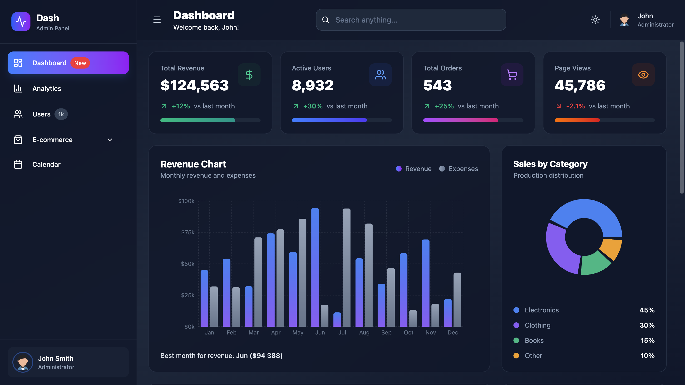
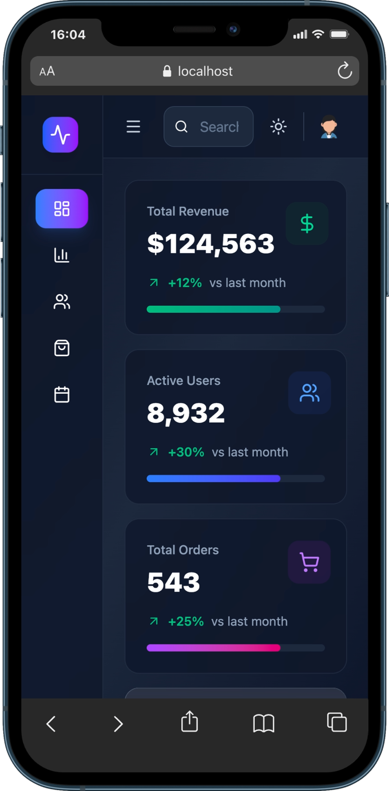
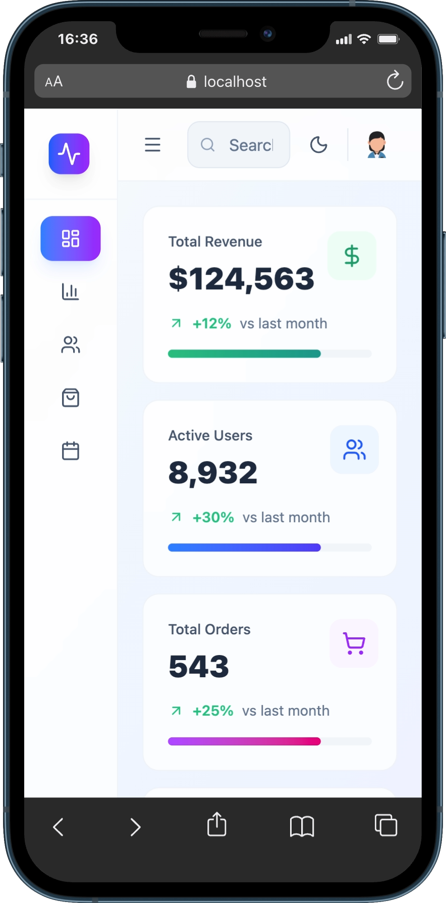

# Dash - Admin Dashboard

This project is a **modern Admin Dashboard** built with **React, Vite, and Tailwind CSS**.  
It focuses on a clean UI, responsive layouts, and reusable components, simulating a real-world admin panel used for analytics, user management, e-commerce, and scheduling.

> ⚠️ **Note:** This project is currently **frontend-only**.  
> A backend (API, authentication, and real data persistence) is **planned for future implementation**.

## 🌐 Live Demo

Check out the live demo:  
[](https://admin-dashboard-three-steel-20.vercel.app/dashboard)

<p align="center">
  <a href="https://admin-dashboard-three-steel-20.vercel.app/dashboard" target="_blank">
    
  </a>
</p>
<p align="center">
  
  
</p>

---

## 🎯 Project Goals

The main goals of this project are to:

- Build a responsive admin dashboard using **React**, **Tailwind CSS**, and **Recharts**
- Implement cards, interactive charts, interactive tables, and calendar management
- Demonstrate modern frontend practices including hooks, modals, responsive layouts, and dark mode support
- Prepare for future backend integration (CRUD, authentication, database)

---

## 🛠️ Technologies & Libraries

### Frontend

- **React** – UI framework
- **Vite** – Fast development and build tool
- **Tailwind CSS** – Utility-first responsive styling
- **React Router DOM** – Client-side routing and navigation
- **Framer Motion** – Animations and transitions
- **Lucide React** – SVG icon library
- **FullCalendar** – Calendar management
- **Recharts** – Charts and data visualization

---

## 💡 Features

- Diverse interactive charts (Pie, Bar, Cartesian Grid,...) for visualizing revenue, sales, and customers data
- Modals for viewing, editing, and managing individual items (users, products, orders and events)
- Calendar with different type of views: day, week, and month
- Dark mode support
- Fully responsive design for mobile and desktop

---

## 🚀 Getting Started

Follow these steps to run the project locally:

### Installation

1. Clone the repository:

```bash
git clone https://github.com/andref218/admin_dashboard
cd admin_dashboard
```

2. Install dependencies:

```bash
npm install
```

3. Run the development server:

```bash
npm run dev
```

## 📂 Project Structure

```text
admin_dashboard/
├── README.md                # Project documentation
├── eslint.config.js         # ESLint configuration
├── index.html               # Main HTML template
├── package-lock.json        # Exact versions of installed dependencies
├── package.json             # Project dependencies and scripts
├── public/                  # Public assets
│   ├── fav_icon.svg         # Site favicon
│   ├── images/              # Image assets
│   │   ├── products/        # Product images
│   │   └── profile_pic_cartoon.png  # Admin profile picture
│   └── vite.svg
├── screenshots/             # Project screenshots for README
│   └── admin_dashboard_preview_dev.png
├── src/                     # React source files
│   ├── App.jsx              # Main React app component
│   ├── assets/              # Static assets for React
│   │   └── react.svg
│   ├── components/          # Reusable React components
│   │   ├── Header.jsx       # Top navigation bar
│   │   └── Sidebar.jsx      # Sidebar navigation menu
│   ├── constants/           # Static data and mock content
│   │   ├── customers.js
│   │   ├── events.js
│   │   ├── index.js
│   │   ├── orders.js
│   │   ├── pageTitles.js
│   │   ├── products.js
│   │   ├── routes.jsx
│   │   └── users.js
│   ├── hooks/               # Custom React hooks
│   │   ├── useDropDownMenu.jsx
│   │   ├── useSelection.jsx
│   │   ├── useSelectionDrag.jsx
│   │   └── useSort.jsx
│   ├── index.css            # Global styles
│   ├── layout/              # Layout components / wrappers
│   │   └── appLayout.jsx
│   ├── main.jsx             # React entry point
│   ├── modals/              # Reusable modal components
│   │   ├── ConfirmDeleteModal.jsx
│   │   ├── EditItemModal.jsx
│   │   └── ViewItemModal.jsx
│   ├── pages/               # Application pages
│   │   ├── Analytics/       # Analytics page
│   │   ├── Calendar/        # Calendar page
│   │   ├── Dashboard/       # Main dashboard page
│   │   ├── Ecommerce/       # Ecommerce overview pages
│   │   ├── ErrorPage.jsx    # 404 / error page
│   │   └── Users/           # Users page
│   └── utils/               # Utility functions
│       └── sortData.js      # Sorting helper
└── vite.config.js           # Vite configuration file
```
